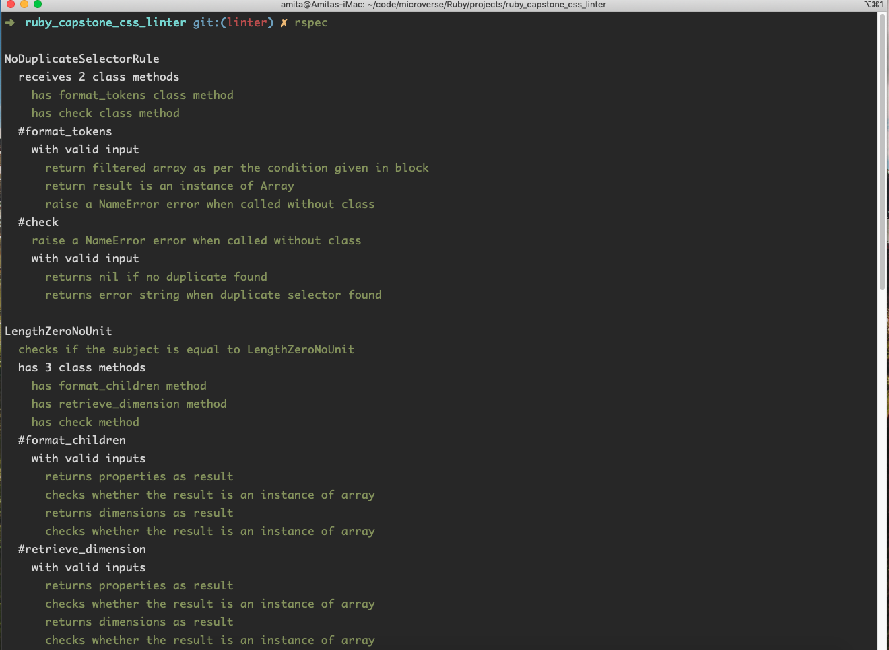

# Ruby Capstone CSS_Linter

> In this project, I have created a css linter with 4 rules.

- You can see the video presentation of the project here: [CSS_Linter](https://github.com/Amita-Roy/Ruby_Capstone_CSS_Linter/issues)

## no-duplicate-selectors (Rule 1)

> Disallow duplicate selectors within a stylesheet.

`.foo {} .bar {} .foo {}`

### This rule checks for two types of duplication:

_Duplication of a single selector with a rule's selector list, e.g. a, b, a {}._
_Duplication of a selector list within a stylesheet, e.g. a, b {} a, b {}. Duplicates are found even if the selectors come in different orders or have different spacing, e.g. a d, b > c {} b>c, a d {}._

## length-zero-no-unit (Rule 2)

> Disallow units for zero lengths.

`a { top: 0px; }`

_Lengths refer to distance measurements. A length is a dimension, which is a number immediately followed by a unit identifier. However, for zero lengths the unit identifier is optional._

## selector-type-case (Rule 3)

> This rule works if selector typecase is in uppercase

`A {}`

_It will throw an error if any selector in the stylesheet is in uppercase._

## valid_units (Rule 4)

> Throws an error if invalid units used in the stylesheet

`a { top: 23pixel; }`

_It will provide suggestion for correct way of use for units eg. instead of `23pixel` use `23px`._

## The files structure of the project

- css directory containing each rule directory for css cases.
- rules directory has all the rules classes
- utils directory has 2 helper files
- main.rb is the file where the linter run method has defined

### Accessing The Linter

- To download the contents of this repository and run the linter locally, follow the steps in the ['Local Installation' section](#local-installation).

## Built With

- Ruby
- VSCode
- Rubocop
- simplecov (gem for test coverage report)
- crass (gem)

There are no pre-requisites for enjoying the game through this method.

## Local Installation

### Prerequisites

If you intend to download the project, you will need to have Ruby already installed on your machine. For more information on how to install Ruby, follow [this link](https://www.ruby-lang.org/en/downloads/).

### Installation Instructions

To get your own copy of our project simply clone the repository to your local machine.

**Step 1**: Using the Command Line, navigate into the location where you would like to have the repository. Then enter the following line of code:

`git@github.com:Amita-Roy/Ruby_Capstone_CSS_Linter.git`

**Step 2**: Once the repo has been cloned, navigate inside it by entering the following command:

`cd ruby_capstone_css_linter`

> crass is CSS parser gem

**Step 3**: before runnind the linter, please install gem crass with the following command

`gem install crass`

**Step 4**: Once in the root directory of the repository, simply enter the following line of code to run the linter on specific css file as per the rules

`ruby main.rb css/no-duplicate-selector/case2.css`
`ruby main.rb css/length-zero-no-unit/case1.css`

it will return the errors from the file if any error found in the stylesheet.

## Repository Contents

> In rules directory

- **length_zero_no_unit**, class for rule length_zero_no_unit is defined.
- **no_duplicate_selector**, class for rule no_duplicate_selector is defined.
- **selector_typecase**, class for rule selector_typecase is defined.
- **valid_units**, class for rule valid_units is defined.

> In utils directory

- **utils.rb**, this file has helper method for all the classes.
- **verify_rules**, this file has all the methods which are required in main.rb.

> In css directory

- **length-zero-no-unit**, directory with css files with each case type.
- **no_duplicate_selector**, directory with css files with each case type.
- **selector_typecase**, directory with css files with each case type.
- **valid_units**, directory with css files with each case type.

In addition to the above, the repo also contains .rubocop.yml for linting.

## To Test

**Step 1**:

_After cloning the repository, open the terminal and Install RSpec on your local system by running:_

`gem install rspec`

**Step 2**:

_Run the tests with the command:_

`rspec`

> Tests screenshots

## Test Coverage

**Step 1**:

`gem install simplecov`

**Step 2**:

_Add the below code on the top of the `spec_helper.rb`_

`require 'simplecov'`

`SimpleCov.start do`
`add_filter '/spec/'`
`end`

**Step 3**:

_After running the rspec command in the terminal, a coverage directory will be generated_
_copy the path of index.html and open it in browser to check the test coverage_

> Test Coverage Screenshot

## Author

👤 **Amita Roy**

- Github: [@Amita-Roy](https://github.com/Amita-Roy)
- Twitter: [@AmitaRoy14](https://twitter.com/AmitaRoy14)
- Linkedin: [Amita Roy](https://www.linkedin.com/in/amita-roy-3b823b68/)

## 🤝 Contributing

Our favourite contributions are those that help us improve the project, whether with a contribution, an issue, or a feature request!

Feel free to check the [issues page](https://github.com/Amita-Roy/Ruby_Capstone_CSS_Linter/issues) to either create an issue or help us out by fixing an existing one.

## Show your support

If you've read this far....give us a ⭐️!

## 📝 License

This project is licensed by Microverse and the Odin Project
